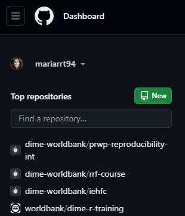
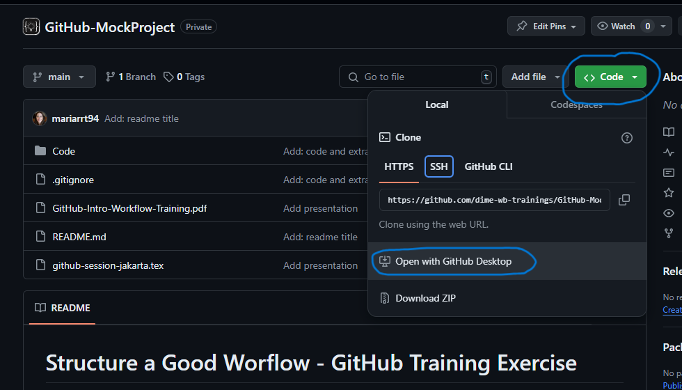
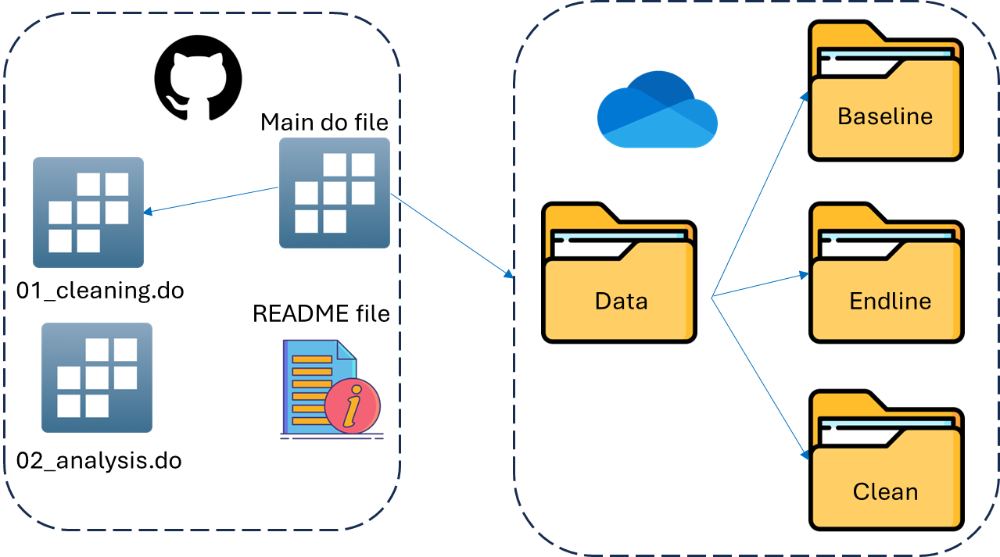
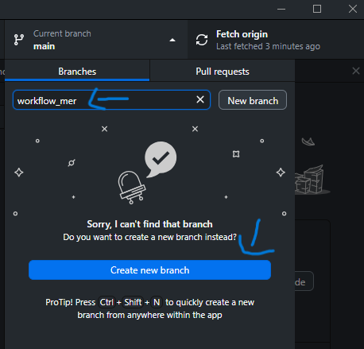

# GitHub Training Exercise README

## Introduction
Welcome to the DIME Analytics training session on implementing a project workflow in GitHub. This interactive training is designed to help participants learn essential GitHub skills for version control and collaboration. You can read more about DIME Analytics Git and GitHub trainings [here](https://osf.io/e54gy/).

## Project Overview
This project aims to teach participants how to use GitHub effectively through practical exercises covering:
- Creating a repository
- Cloning the repository
- Setting up a folder structure
- Creating branches
- Using a main script
- Creating a comprehensive README file

This repository is part of the "Integrating GitHub into Your Project Workflow: Best Practices and Hands-On Exercises" training. It includes key elements to help you establish a well-structured data project. Follow along and make modifications as we progress through the training.

## Training Exercises

*Note: For this training, the repository has already been created. This is just for reference*

### 0. Repository Creation
1. Go to GitHub and log in to your account.
2. Click on the "New" button to create a new repository.
3. Enter a name for your repository.
4. Set the repository visibility to private if necessary.
5. Click "Create repository".




### 2. Cloning the Repository
1. Go to the GitHub repository: [GitHub-MockProject](https://github.com/dime-wb-trainings/GitHub-MockProject).
2. Click on the green "Code" button and select "Open with GitHub Desktop".
3. Follow the prompts to clone the repository to your local machine.



### 3. Setting Up the Folder Structure
1. Download the mock data from the provided link.
2. Save the data files to the desired location on your local machine.
3. See the two roots of your project: \texttt{data/} and \texttt{code/}.
4. Arrange the folder structure intuitively as follows:

    ```text
    code/
    ├── cleaning/
    ├── analysis/
    ├── visualization/

    data/
    ├── raw/
    ├── intermediate/
    ├── analysis/

    outputs/ - Folder for your outputs, if relevant.
    README.md - Project documentation.
    .gitignore - Specify files and folders to ignore in Git.
    ```



### 4. Creating a Branch
1. As we will be working collaboratively, create a branch named `workflow_` followed by your initials.
2. Switch to that branch to start making changes to the project.
3. Follow the principle: branch often, merge often. Create a branch for each task and merge it back to the main branch by creating a Pull Request (PR).



### 5. Setting Up the Main Script
1. Open the `main.do` file in the mock project folder (make sure you are in your own branch).
2. Make the necessary modifications in the `main.do` file to match your project structure:
    - Add the paths to match your computer and structure.
    - See how the global paths are set dynamically.
3. Use GitHub Desktop to commit your changes.
4. Push/Publish your changes to GitHub.


### 7. Exploring README and .gitignore Files
1. Open the `README.md` file in the repository.
    - Provides a summary of the project's purpose and objectives.
    - Includes setup instructions, key decisions, and usage instructions.
2. Open the `.gitignore` file in the repository.
    - Prevents tracking of sensitive or unnecessary files.
    - Keeps the repository clean and focused.
    - Avoids conflicts from environment-specific files.
